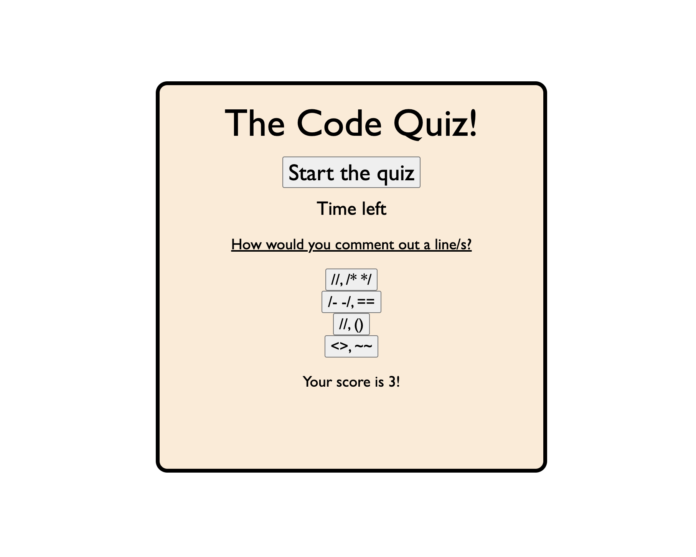

This task involved creating a quiz using HTML, CSS and Javascript. 
The HTML element is very simple, mostly only including the ids and classes to be used in the Javascript and CSS files, as well as adding structure to the whole page. 
The quiz consists of 5 different questions, with 4 possible answers to select for each question.
The quiz is timed, and the timer begins upon starting the quiz.
One question is shown at a time, and once an answer has been selected, the question is replaced by the following question. 
Once the last question has been answered, a score is given (between 0 and 5) for all of the correct answers selected, and the timer stops.
If the questions are not all answered by the time the timer reaches 0, the quiz finishes and an alert shows.

